Project 2 - Advance lane finding

This project goal is to find the lane , calculate curvature and draw lane

### Steps to process the image

- Camera Calibration
- Distortion correction on a raw image
- Calculate the directional gradient
- Calculate the gradient magnitude
- Calculate the gradient direction
- Calculate the color threshold
- Combine all threhsold
- Perspective transform to the image
- Calculate histogram
- Detect lane line
- Calculate the radius of curvature and offset
- Draw lane line
- Display calculated value

## Camera Calibration

We need to make sure the camera install in the car is accurate and should provide the same output for the same input in all environments. With the help of OpenCV, we could achieve the desired result.

* Read all the chessboard image from `camera_cal`, make sure to have more than 20 image for good result
* Convert the image to grayscale
* by help of `open.cv2` function `findChessboardCorners` get all the corners
* Now with the help of `cv2.calibrateCamera` function calibrate the camera and save the points for future use.
* Now its time to calculate the undistorted image using `cv2.undistort`

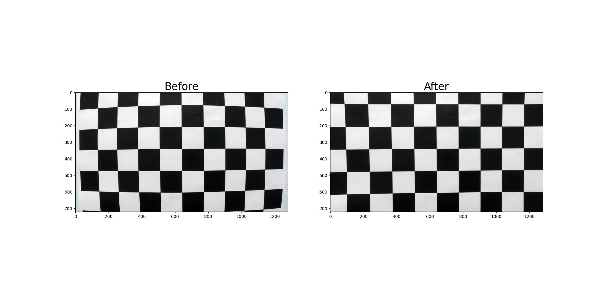

## Distortion correction on a raw image

undistorted image is necessary to eliminate any distortion in image . undistorted image can be achieve using `open.cv` function.

```python
cv2.undistort(distort_image # normal image
              cameraMatrix # calculated from camera calibration
              distortionCoeffs) # calculated from camera calibration
```

Below you can see left distorted image and on right undistorted image

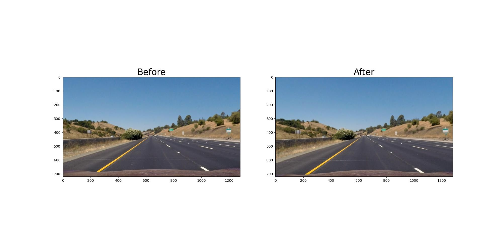

## Calculate the directional gradient

To create the directional gradient threshold binary image. We need to calculate the sobel-x and sobel-y on undistort image.

* Convert the image to grayscale image
* Apply sobel with help of `open.cv` function `cv2.Sobel` and calculate the absolute
* Resize the image
* Apply the threshold maximum **100** and threshold minimum **30** value to the image

#### Sobel x


#### Sobel y

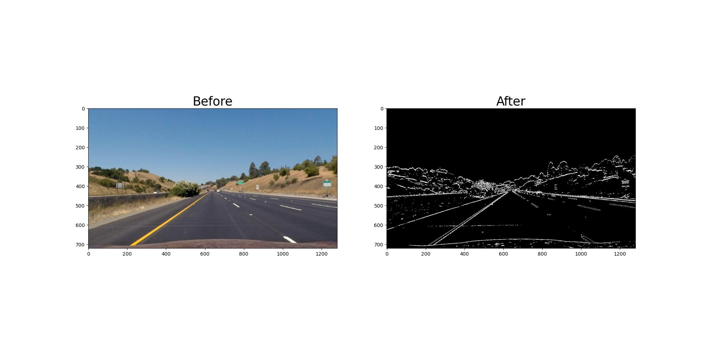

## Calculate gradient magnitude

To create gradient magnitude threshold binary image, we need a formula 

**np.sqrt((sobel_x2)+(sobely2))** on undistroted image.

* convert the image to grayscale image
* Get sobel value of x and y for the image
* Calculate the gradient magnitude via above formula and rescale it
* To get best result use *sobel_kernel* as **15**
* Apply the threshold maximum **100** and threshold minimum **70** value to the image

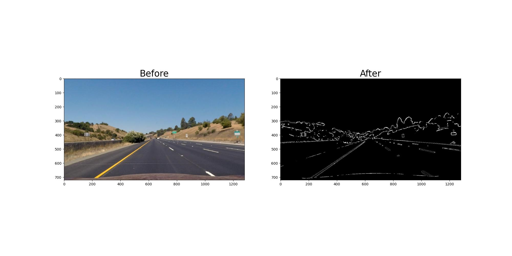

## Calculate gradient direction

To calculate the gradient direction threshold binary image. We can use `cv2.arctan2` function.

* Convert the image to grayscale
* Apply sobel value in x and y image
* calculate the gradient direction using `open.cv` function `cv2.arctan2`.
* set sobel_kernel as **15**
* Apply the threshold maximum **1.3** and threshold minimum **0.7** value to the image

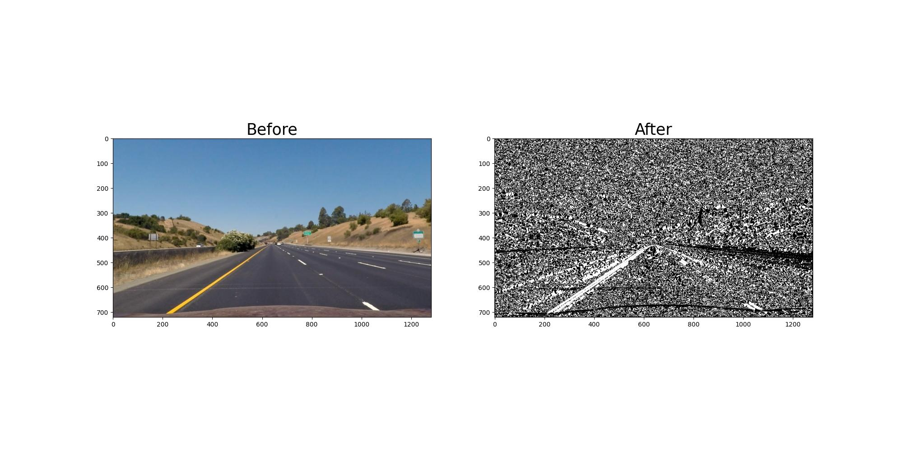

## Color threshold

By calculating HSL we could get more accurate lane line detection. We can get H, L, S color threhold binary conversion.

* Convert the undistorted image to H or S or L channel color
* **H** color channel in `[:, :, 0]` , **L** channel color in `[: , :, 1]` , **S** channel color in `[:, :, 2]`
* Apply the threshold value to calculate the binary threhold

#### H channel

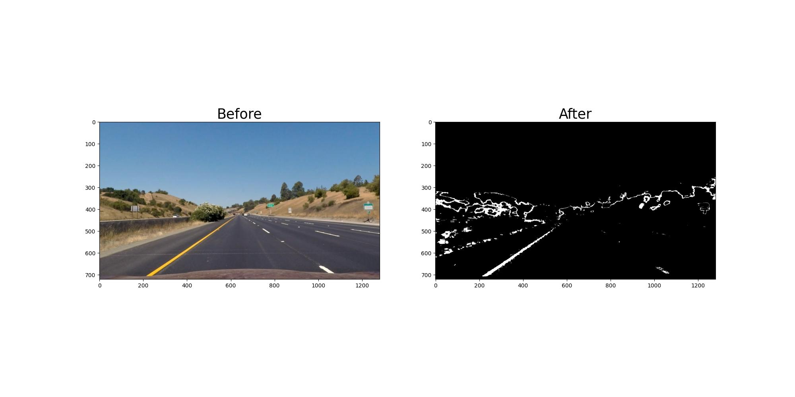

#### L channel

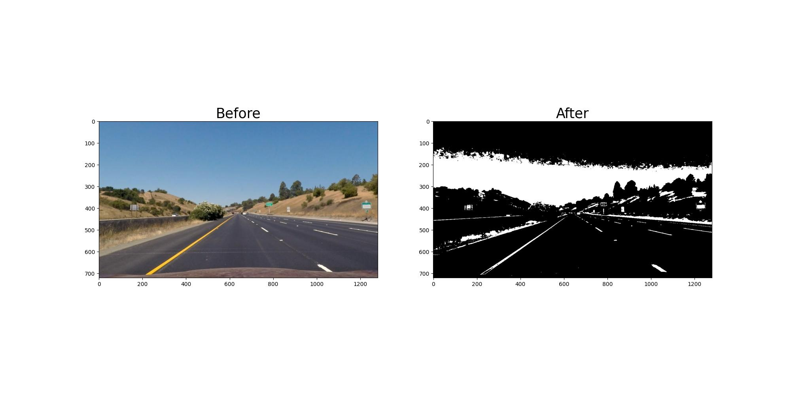

#### S channel


## Combine all the threshold

To get the maximum result adding all the threshold and create a binary image.

```python
((sobel_x_threshold_ == 1) & (sobel_y_threshold_ == 1)) | 
((gradient_magnitude_threshold_ == 1) & (gradient_direction_threshold_ == 1)) |
(color_threshold_S == 1)
```

for color threshold we consider S channel as it does better performance

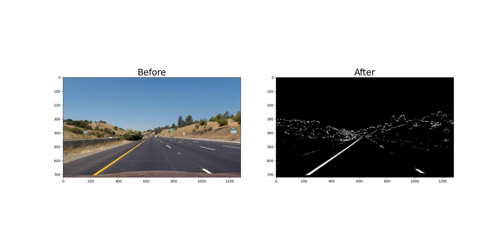

## Perspective transformation

Next thing we are going to do birds eye view. This transform a image perspective to another angle.

* For this process we need source point and destination point which take by assumption.
* We need to calculate the perspective transform by `cv2.getPerspectiveTransform`
* To do inverse perspective transform swap source and destination
* next we need to wrap perspective transform `cv2.warpPerspective`

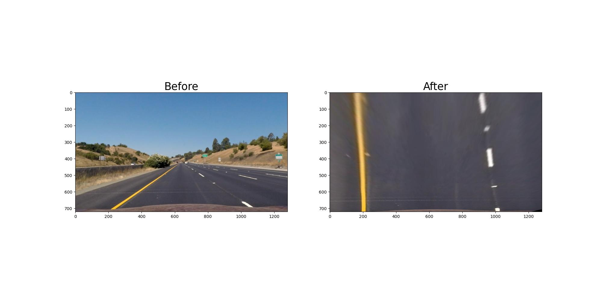

## Calculate the histogram

we need to calculate histogram to accurate representation of the image data. We need to calculate lower half of the warp image.

```python
np.sum(warp_image[warp_image.shape[0]//2:, :], axis=0)
```

below you can see calculated histogram of warp image

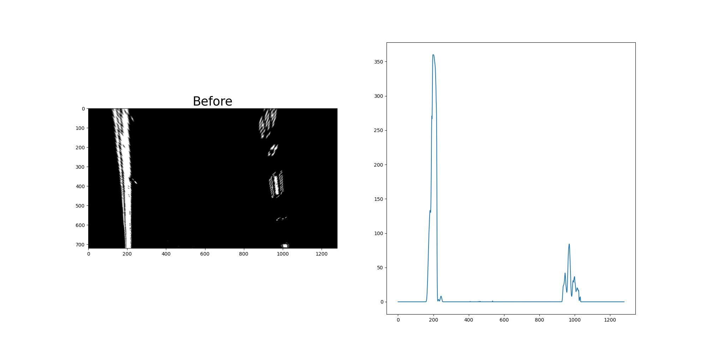

## Detect lane line

By using sliding window to identify the coordinates of the lane line in image. left and right lane are selected by max value of the histogram.

* calculate the histogram of the image

* find in the peak of the histogram by selecting max value to the left and right position

* By calculating previous value calculate all the polynomial for both left and right by using `cv2.ployfit`

* once we got value we assume we got points for further

#### Sliding window


#### Detect lane line

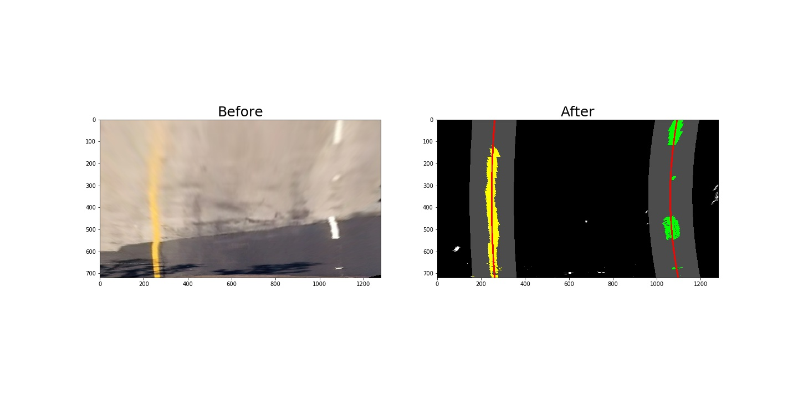

## Calculate the radius of curvature and offset

Now we need to calculate the radius and offset from the image.

In short,

* Calculate the polynomial to pixel
* polynomial in world space
* now calculate the radius
* the convert radius to meter
* for offset get mid position and take average of left and right points then `mid-avg*per_pixel`

#### left

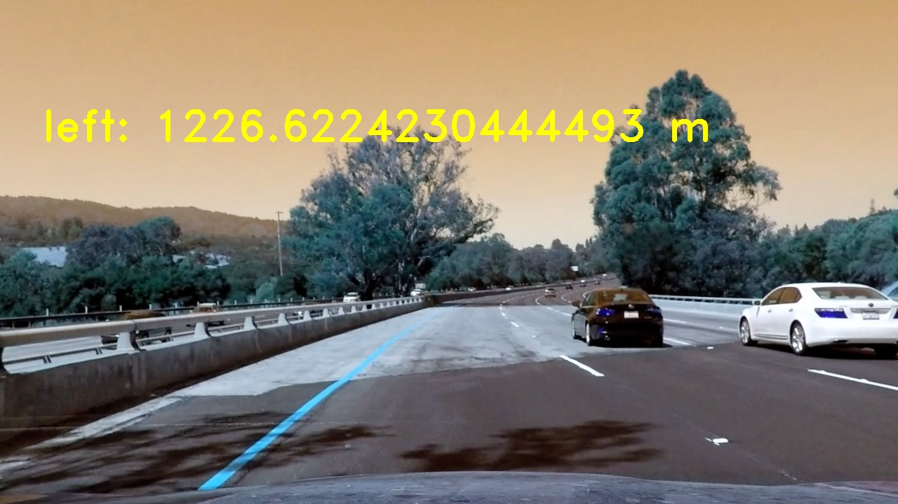

#### right

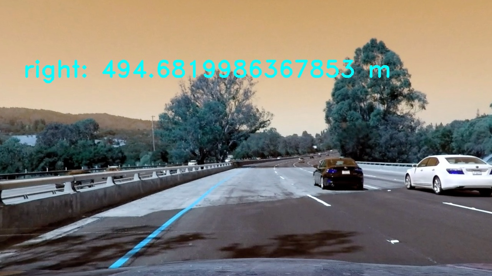

#### offset

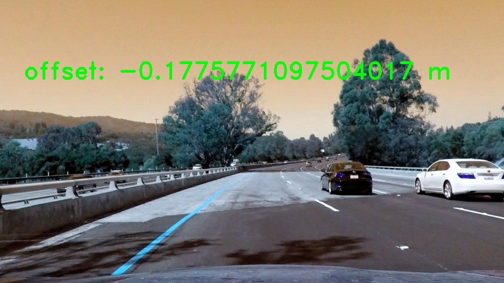


## Draw lane line

By calculating detect lane pixel we can mark the points in the image and merge to it.

* draw the calculated points in to the blank image
* use open.cv function to draw
* merge the final result

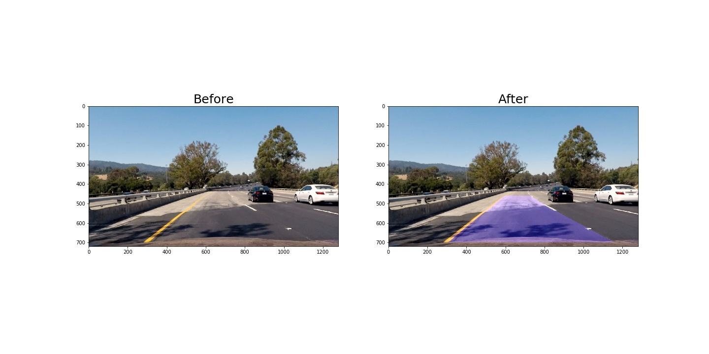

## Display calculated value

by using above operations now mark values in the image. now mark left line curve, right line curve, and offset

### Final image

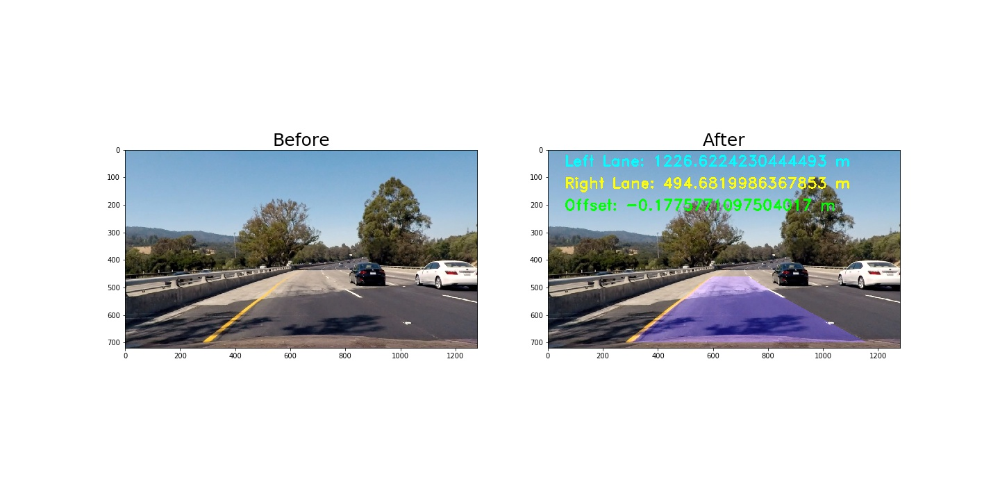

# Improvement

* problems / issues you faced in your implementation of this project ? 

  * On calculating the detect lane and marking on the imahe

* Where will your pipeline likely fail? 

  * it will fail on dark image or shadow due to threshold value chanes
  * my calculation should work on long curve but fails
  * near by objects also create noise on line, like tree shadow or car shadow

* What could you do to make it more robust?

  * a perfect failsafe code to run on lane most of the time
  * reduce noise near lines

* and make more time on project to eleminate last minute bugs and long write up and better sleep. :)
